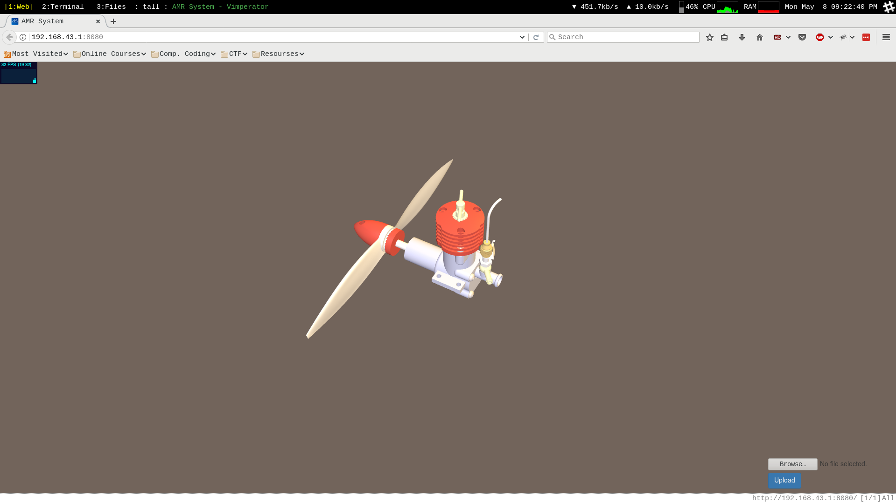

# AMR System
_An android app to fetch and fuse sensor data from an android phone to detect its motion and use it to control the CAD model displayed in the WebPage at the specified URL._

### Team members
* [Dipendra Singh](https://github.com/sdipendra)
* [Nikhil Sonkul](https://github.com/sonkul)
* [Shivanshu Singh](https://github.com/shivnshu)

## Usage
1. Download the apk file either from github releases section or from [Play Store](https://play.google.com/store/apps/details?id=com.amr_system.shivnshu.androidapp).
2. Grant necessary permissions and go to indicated url in the web browser (tested on Chrome and Firefox).
3. On the webpage, we can control the CAD model using mobile orientation and also zoom in, zoom out using volume keys.
4. Using upload button at bottom-right, we can also upload a CAD model (STL file format).

**Note:** Since, this app uses [TYPE_ROTATION_VECTOR](https://developer.android.com/reference/android/hardware/Sensor.html#TYPE_ROTATION_VECTOR) in-build sensor, it may crash on devices that doesn't have it.

## Screenshots

## License
See [LICENSE.txt](https://github.com/shivnshu/AMR-System/blob/master/LICENSE.txt) for more information
